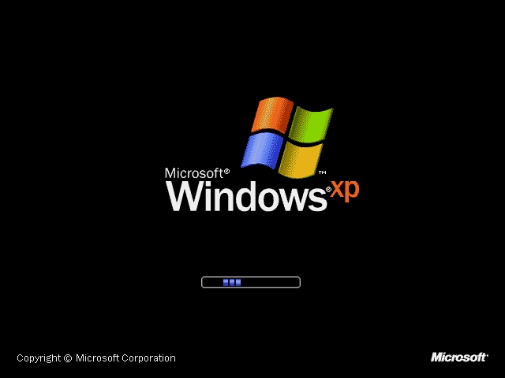

#  :desktop_computer: Win-Wallpaper
 


This script will help automate the changing of your wallpapers randomly on a minute, hourly, or daily basis using Python 3 for downloading random wallpapers from Unsplash, PowerShell scripts to set the desktop wallpaper, and Task Scheduler to automate the process.


## Requirement
python3  
curl 

## Usage


* Open cmd & copy paste the below commands 

 ```
cd %appdata% && mkdir Win-Wallpaper 

curl -s https://raw.githubusercontent.com/raoshaab/Win-Wallpaper/main/wallpaper.py -o Win-Wallpaper/wallpaper.py
curl -s https://raw.githubusercontent.com/raoshaab/Win-Wallpaper/main/power_script.ps1 -o Win-Wallpaper/power_script.ps1
curl -s https://raw.githubusercontent.com/raoshaab/Win-Wallpaper/main/task_script.vbs -o Win-Wallpaper/task_script.vbs


schtasks /create /sc hourly   /tn Wallpaper_change_hour /tr "%appdata%/Win-Wallpaper/task_script.vbs" /st 00:00
```

## Demo


### Task scheduling 

* To schedule the task every hour 
```
schtasks /create /sc hour /mo 1 /tn Wallpaper_change_hour /tr "%appdata%/Win-Wallpaper/task_script.vbs" /st 00:00
```

* To schedule the task every minute 
```
schtasks /create /sc minute /mo 1 /tn Wallpaper_change_minute /tr "%appdata%/Win-Wallpaper/task_script.vbs" /st 00:00
```

* To schedule the task daily
```
schtasks /create /sc daily  /mo 1 /tn Wallpaper_change_daily /tr "%appdata%/Win-Wallpaper/task_script.vbs"  /st 00:00
```

### To remove all tasks 

```
schtasks /delete /tn Wallpaper_change_hour /f
```
If you have added minute & everyday 
```
schtasks /delete /tn Wallpaper_change_minute /f
schtasks /delete /tn Wallpaper_change_everyday /f
```

### To remove the script from system 

```
rmdir %appdata%\Win-Wallpaper /s /q 
```
